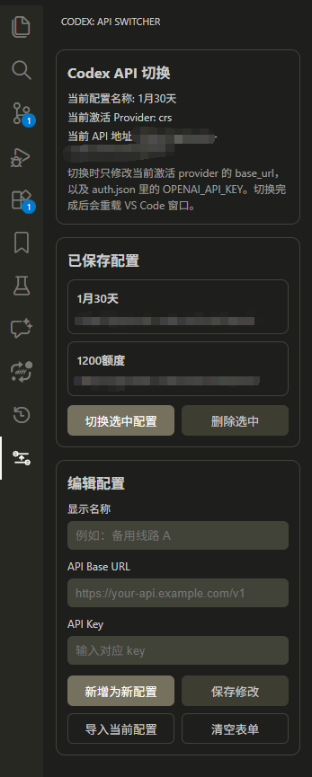

# Codex Profile Switcher VS Code

在 VS Code 侧边栏里切换 Codex 的 API 配置，不用手动反复改 `~/.codex/config.toml` 和 `~/.codex/auth.json`。


下载地址:

- [v1.0.1 Release](https://github.com/YuFeng128/codex-profile-switcher-vscode/releases/tag/v1.0.1)

预览:

<p align="center">
  
</p>

## 功能

- 在侧边栏保存多套 Codex API 配置并快速切换
- 切换当前激活 provider 的 `base_url`
- 切换 `auth.json` 中的 `OPENAI_API_KEY`
- 支持按配置勾选是否开启快速响应，并写入或移除 `service_tier = "fast"`
- 显示当前生效的配置、当前 provider、当前 API 地址
- 支持 API Key 明文显示/隐藏
- 切换前自动备份配置文件
- 切换完成后自动重载 VS Code 窗口

## 安装

### 方式一：安装 VSIX

1. 打开 [Releases](https://github.com/YuFeng128/codex-profile-switcher-vscode/releases/tag/v1.0.1)
2. 下载 `codex-profile-switcher-1.0.1.vsix`
3. 在 VS Code 中执行 `Extensions: Install from VSIX...`
4. 选择下载好的 `.vsix` 文件

### 方式二：本地开发

```powershell
cd .\vscode-extension
npm install
npm run compile
```

然后用 VS Code 打开 `vscode-extension` 目录，按 `F5` 启动扩展开发宿主。

## 使用

1. 在侧边栏点击 `Codex`
2. 填写 `显示名称`、`API Base URL`、`API Key`
3. 按需勾选 `开启快速响应配置`
4. 点击 `新增为新配置` 或 `保存修改`
5. 在左侧列表选择目标配置
6. 点击 `切换选中配置`
7. 扩展会自动重载 VS Code 窗口

## 切换规则

- 读取当前激活的 `model_provider`
- 更新该 provider 下的 `base_url`
- 根据勾选状态写入或移除 `service_tier = "fast"`
- 更新 `C:\Users\Administrator\.codex\auth.json` 中的 `OPENAI_API_KEY`
- 不修改 `model`、`wire_api`、`model_provider` 等其它配置

## 数据存储

- 配置列表保存在扩展的 `globalState`
- 备份文件保存在扩展的 `globalStorage/backups`
- 生效文件:
  - `C:\Users\Administrator\.codex\config.toml`
  - `C:\Users\Administrator\.codex\auth.json`

## 更新日志

- [CHANGELOG.md](./CHANGELOG.md)

## License

[MIT](./LICENSE)
