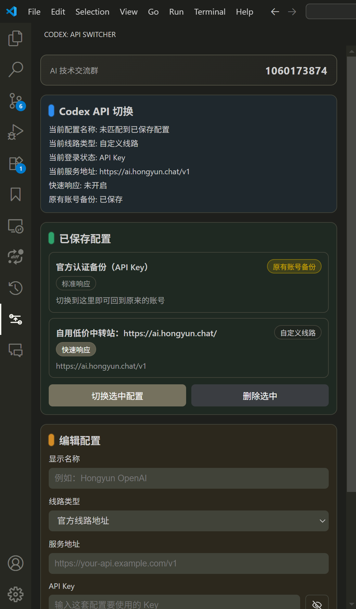

# Codex Profile Switcher VS Code

用 VS Code 侧边栏一键切换 Codex 使用的账号或 API Key，不用再手动改 `~/.codex/config.toml` 和 `~/.codex/auth.json`。


## 这是什么

这是一个安装在 VS Code 里的 Codex 配置切换工具，适合下面这些场景：

- 你有多个账号，想来回切换
- 你有多套 API Key，想保存起来随时切换
- 你不想每次都手改配置文件
- 你担心切换后把原来的聊天记录、原来的登录状态弄乱

虽然入口在 VS Code 里，但它修改的是 Codex 的配置文件和认证文件。也就是说，只要是同一台机器上读取这套 Codex 配置的环境，都能用到这次切换结果，不一定只限于 VS Code，Codex 桌面端这类场景也可以。

这个插件的重点不是“高级配置”，而是帮你把常见切换动作做成按钮。

## 它能帮你解决什么

- 保存多套账号 / Key 配置
- 在 VS Code 侧边栏里直接切换
- 改的是 Codex 通用配置，不是只改某一个聊天窗口
- 自动识别当前是官方登录、API Key，还是其他状态
- 如果你原来用的是官方账号，切换前会自动保存一份“原有账号备份”
- 以后想切回原来的号，直接切换回这个备份就行

## 聊天记录会不会丢

正常使用这个插件时，原来的聊天记录不会被插件删除。

需要区分两件事：

- 这个插件改的是 Codex 配置，不是去删除聊天记录文件
- 如果不同环境本来就读取同一套 Codex 配置，那么切换结果也会同步体现在这些环境里

这个项目专门做了两件事，尽量减少“切换后像是换了一个新环境，聊天记录对不上”的情况：

- 优先支持使用内建 `openai` 线路切换，避免因为自定义 provider 名称不同导致会话分流
- 如果你原来是官方登录，会自动备份原来的认证和配置，方便随时切回

更直接地说：

- 插件不会清空你的聊天记录
- 插件不会把你原来的官方账号覆盖掉不让你回来
- 如果你切的是推荐方式，聊天记录更不容易因为 provider 冲突而分散

预览:

<p align="center">
  
</p>

## 小白安装教程

最简单的用法就是直接安装 `.vsix`。

### 第一步：拿到安装包

你可以使用本地构建好的安装包：

- `codex-profile-switcher-1.0.3.vsix`

也可以直接打开 GitHub Releases 下载对应版本：

- [点击前往 Releases 页面](https://github.com/YuFeng128/codex-profile-switcher-vscode/releases)

### 第二步：安装到 VS Code

1. 打开 VS Code
2. 打开左侧“扩展”面板
3. 点击右上角 `...`
4. 选择 `Install from VSIX...`
5. 选中 `codex-profile-switcher-1.0.3.vsix`
6. 安装完成后，按提示重载 VS Code

### 第三步：打开插件

1. 看左侧活动栏
2. 找到 `Codex` 图标
3. 点进去就能看到切换面板

## 小白使用教程

如果你只是想“保存一套 Key，然后以后点一下就切换”，按下面做就够了。

### 场景一：新增一套 API Key 配置

1. 打开左侧 `Codex`
2. 在“编辑配置”里填写：
   - `显示名称`
   - `服务地址`
   - `API Key`
3. 如果这是常见 OpenAI 兼容地址，`线路类型` 选 `官方线路地址`
4. 点击 `新增为新配置`

这样这套配置就保存好了。

### 场景二：切换到另一套账号或 Key

1. 在“已保存配置”里点击你要用的那一项
2. 点击 `切换选中配置`
3. 等待 VS Code 自动重载

切换完成后，插件会把对应配置写入 Codex 当前使用的配置里。

如果你的 Codex 桌面端或其他 Codex 环境也读取这套本机配置，那么它们也会跟着使用这次切换后的账号 / Key。

### 场景三：切回原来的官方账号

如果你原来用的是官方登录，第一次切走之前，插件会自动保存一项：

- `原有账号备份`

想切回去时：

1. 在列表里选中 `原有账号备份`
2. 点击 `切换选中配置`

这样就会恢复原来那套官方登录配置和认证信息。

## 推荐给小白的使用方式

如果你不确定该怎么选，优先这样用：

1. `线路类型` 先选 `官方线路地址`
2. 填你的 `服务地址`
3. 填你自己的 `API Key`
4. 保存后直接切换

这样通常更稳，也更不容易出现“聊天记录像换了地方”的问题。

## 适用范围

这个项目的使用入口是 VS Code 扩展，但生效范围是 Codex 配置文件本身。

- 你在 VS Code 里点一下切换
- 插件会改 `~/.codex/config.toml` 和 `~/.codex/auth.json`
- 其他读取同一套 Codex 配置的环境，也会读到切换后的结果

所以更准确地说，它是“用 VS Code 管理 Codex 配置”，而不是“只给 VS Code 里的对话单独切换”。

## 交流群

- AI 技术交流群 QQ：`1060173874`

<p align="center">
  
  
</p>

## 技术特性

- 在侧边栏保存多套 Codex API 配置并快速切换
- 支持两种线路：
  - 官方线路地址：适合大多数代理地址，聊天记录更不容易分散
  - 独立线路配置：适合必须使用单独线路标识的服务
- 每套普通配置使用自己的 API Key，切换时会同步切换 Key
- 自动识别当前登录状态（API Key / OpenAI 账号 / 访问令牌 / 未知）
- 支持识别 `config.toml` 中未显式配置 provider、但 `auth.json` 中存在官方账号 token 的内置 OpenAI 默认场景
- 如果当前是官方账号或官方线路，切换前自动保存一份“原有账号备份”，后续可以通过切换这个配置回到原来的号
- 高级设置里支持快速响应、表达风格和旧版登录偏好
- 显示当前生效的配置、线路类型、登录状态、服务地址
- 支持 API Key 明文显示/隐藏
- 切换前自动备份配置文件
- 切换完成后自动重载 VS Code 窗口

## 技术说明

### 切换规则

- 如果配置模式是 `内建 OpenAI`：
  - 写入 `model_provider = "openai"`
  - 写入 `openai_base_url`
- 如果配置模式是 `自定义 Provider`：
  - 写入 `model_provider = <providerId>`
  - 删除其它 `[model_providers.*]` 段，仅保留目标 `[model_providers.<providerId>]`
- 根据勾选状态写入顶层 `service_tier = "fast"` 或 `service_tier = "default"`
- 普通配置切换时，会更新 `auth.json` 中的 `OPENAI_API_KEY`
- 表达风格会写入顶层 `personality`，可选值参考官方 Codex 配置：`none`、`friendly`、`pragmatic`
- 当前如果是内建 OpenAI 或 `requires_openai_auth = true` 的 provider，切换前自动保存“原有账号备份”
- 选择“原有账号备份”配置时，会直接恢复保存时的 `config.toml` 与 `auth.json`

### 数据存储

- 配置列表保存在扩展的 `globalState`
- 备份文件保存在扩展的 `globalStorage/backups`
- 生效文件：
  - `C:\Users\Administrator\.codex\config.toml`
  - `C:\Users\Administrator\.codex\auth.json`

## 开发

```powershell
cd .\
npm install
npm run compile
```

然后用 VS Code 打开当前项目目录，按 `F5` 启动扩展开发宿主。

## 更新日志

- [CHANGELOG.md](./CHANGELOG.md)

## License

[MIT](./LICENSE)
